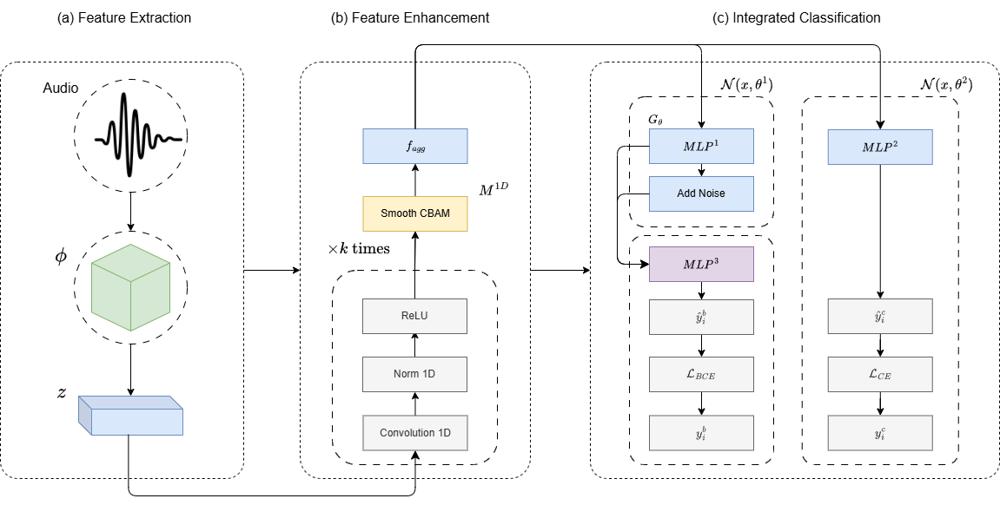

## 1. Overview

This is the Pytorch implementation for "Proposed Robust Model for Speech Command Detection and Recognition Using an Integrated Classifier (xxx25)"

Authors: Van-Hoa Nguyen, Viet-Cuong Ta

Paper: [Proposed Robust Model for Speech Command Detection and Recognition Using an Integrated Classifier](https://www.xxxxx)



## 2. Setup

### 2.1 Environment
`pip install -r requirements.txt`

### 2.2 Datasets
The data will be automatically downloaded and processed

## 3. Experiments

3.0 To run IntergratedNetwork:

```python main.py```

3.0 To test IntergratedNetwork:

```python test.py```

3.1 Dataset choices: [google/speech_commands](https://huggingface.co/datasets/google/speech_commands)

## 4. Backbone
- [wav2vec2-base](https://huggingface.co/facebook/wav2vec2-base)
- [wav2vec2-base-960h](https://huggingface.co/facebook/wav2vec2-base-960h)
- [wav2vec2-large](https://huggingface.co/facebook/wav2vec2-large)
- [wavlm-base](https://huggingface.co/microsoft/wavlm-base)
- [wavlm-large](https://huggingface.co/microsoft/wavlm-large)